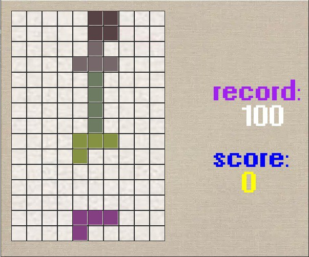

# Tetris game (application features)
Снизу описано, что я реализовала

Фишки :
* Играется наоборот, верх ногами  
* Добовлена слово 'great!' после каждого бонуса

Бонусы :
  * сохранение результатов игрока после закрытия игры
  * Увелечение сложности игры со временем
  * Релизование шейринга своего рекорда
  * Добовление в игру новых деталий (фишек)

## Installation

Create python (Python 3.11.3) venv.

```bash
python3 -m venv venv
```
Activate python venv.

```bash
source venv/bin/activate
```
or 
```bash
.\venv\activate
```
Use the package manager [pip](https://pip.pypa.io/en/stable/) to install the requirements file.

```bash
pip3 install -r requirements.txt
```

## Usage

```bash
# run python project 
python main.py
```

## Final

